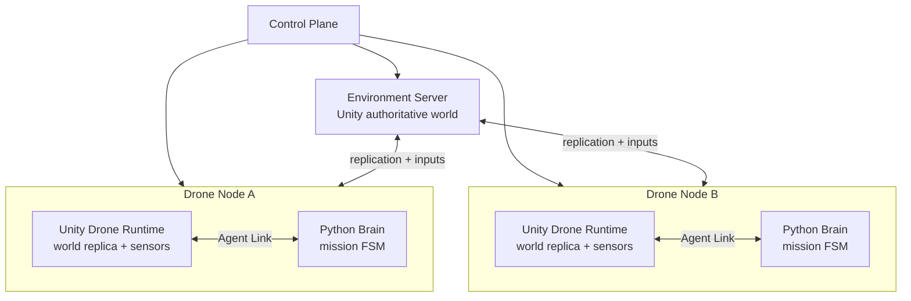

# MassAI Networked Simulation Infrastructure

MassAI Networked Simulation Infrastructure is a portfolio-grade distributed autonomy simulation platform. An authoritative simulation environment owns world truth and physics. Independently deployable drone runtimes join the same world, render their own sensors, and expose a stable engine-neutral link to replaceable autonomy workloads.

The project is intentionally built as a platform rather than a single Unity scene.

## Current vertical slice

Stage 1 establishes the contracts and proves the autonomy boundary without requiring Unity:

- authoritative ownership and trust boundaries are documented;
- an engine-neutral Protocol Buffers contract describes sensor, mission, control, and lifecycle messages;
- a dependency-free Python reference brain implements take-off, waypoint flight, observation, visual tracking, virtual object tagging, return, and landing;
- a deterministic kinematic harness supplies camera-visible ground-truth observations and validates the closed loop;
- unit tests cover visibility isolation, command completion, and tag dwell behavior.

`TAG_OBJECT` is a benign virtual mission action. It demonstrates command routing, target acquisition, dwell, and result reporting; this repository does not implement a weapon system.

## Target topology



The Environment Server and Drone Nodes are sibling workloads. Containers are never nested. In the isolated cloud topology, a Drone Node is one pod with a Unity runtime container and a Python brain sidecar. A packed sensor-runtime topology can be added later for high-throughput training.

## Run Stage 1

Requires Python 3.11 or newer. The reference brain has no third-party runtime dependencies.

### PowerShell

```powershell
./scripts/run-agent-demo.ps1
./scripts/test.ps1
```

### Bash

```bash
./scripts/run-agent-demo.sh
./scripts/test.sh
```

The demo writes structured JSON events to stdout. A successful run ends with `demo.completed` and all mission commands in the `succeeded` state.

## Repository map

```text
agents/python-reference-brain/  Replaceable autonomy workload and tests
contracts/                      Engine-neutral wire contracts
docs/                           Architecture, protocol, and delivery decisions
scenarios/                      Declarative demo missions
scripts/                        Reproducible local entry points
simulation-unity/               Added in Stage 2
services/                       Added with control plane/operator gateway
infra/                          Added with container and cloud deployment
```

## Non-negotiable invariants

1. The Environment Server is authoritative for world state and accepts intents, never client transforms.
2. A brain can consume only its declared sensor envelope; it cannot read Unity scene objects or global transforms.
3. Sensor rendering belongs to the Drone Runtime that represents onboard compute, while world truth remains authoritative on the Environment Server.
4. Simulation time and wall-clock time are explicit and never conflated.
5. Every command, observation, setpoint, and result carries identity and sequence metadata.
6. Transport implementations are replaceable behind versioned contracts.
7. Claims about scale are backed by measurements, not architecture diagrams.

See [architecture](docs/architecture.md), [protocol](docs/protocol.md), and [delivery plan](docs/delivery-plan.md).
